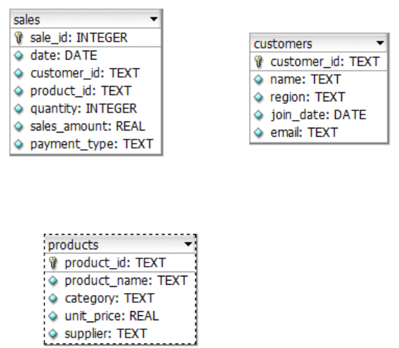
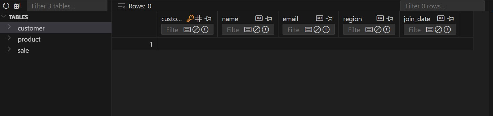
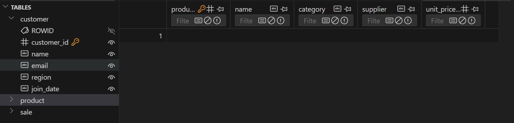
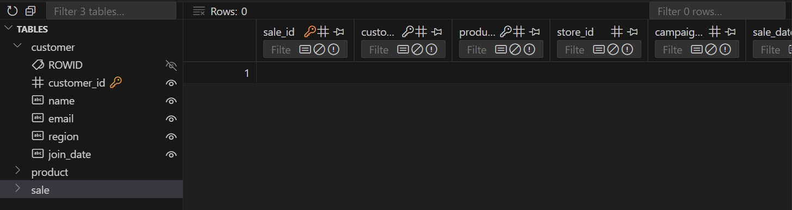

## smart-store-marco
P1. Project Start &amp; Planning (GitHub Repo, clone down, organize)

Project Setup Instructions

**1. Create Local Project Virtual Environment (One-Time Task)**  
Use only `python3` commands; `py` doesn't work right. cd to "C:\Users\4harg\Documents\smart-store-marco" 
```bash
python3 -m venv .venv`
```
> This command creates a new virtual environment in a folder named `.venv`. A virtual environment is an isolated workspace where you can install packages without affecting your system Python installation.


**2. Activate Virtual Environment (Every Time we Open a Terminal to work on the Project)**  

>First use:

```bash
Set-ExecutionPolicy RemoteSigned -Scope Process
```
Then:

```bash
.venv\Scripts\activate
```
> This command activates the virtual environment, allowing you to use the installed packages in your project.


**3. Install Requirements**  
```bash
`python3 -m pip install --upgrade -r requirements.txt`
```
> This command installs the required packages listed in `requirements.txt`, ensuring your project has all the dependencies it needs.


**4. Create utils/logger.py**  

In VS Code, use File / New Folder to create a new folder named `utils` to hold your utility scripts. I will provide these. You are encouraged to use them exactly as provided. In this folder, create a file named `logger.py` (exactly). Copy and paste the content from the starter repo linked above.


**5. Create scripts/data_prep.py**  

In VS Code, use File / New Folder to create a new folder named `scripts` to hold your scripts. In this folder, create a file named `data_prep.py` (exactly). Copy and paste the content from the starter repo linked above.


**6. Run Python Script**  
```bash
python3 scripts/data_prep.py
```
> This command runs the Python script located in the `scripts` folder, executing any code contained within.


**7. Git add-commit-push Your Work Back up to GitHub Project Repository**  
```bash
git add .
```
> This command stages all your changes for the next commit. 
 
```bash
git commit -m "add starter files"
```
> This command creates a new commit with a message describing what you’ve done.  

```bash
git push -u origin main
```
> This command uploads your committed changes to the `main` branch of your GitHub repository.

### P3. Prepare Data for ETL
Error: 
> FAIL: test_format_column_strings_to_upper_and_trim (__main__.TestDataScrubber.test_format_column_strings_to_upper_and_trim)     
----------------------------------------------------------------------
Traceback (most recent call last):
  File "C:\Users\4harg\Documents\smart-store-marco\test\test_data_scrubber.py", line 87, in test_format_column_strings_to_upper_and_trim
    self.assertTrue(df_formatted['Name'].str.isupper().all(), "Strings not formatted to uppercase correctly")
AssertionError: False is not true : Strings not formatted to uppercase correctly

Fix:
```python
def format_column_strings_to_upper_and_trim(self, column: str) -> pd.DataFrame:
        """
        Format strings in a specified column by converting to uppercase and trimming whitespace.
    
        Parameters:
            column (str): Name of the column to format.
    
        Returns:
            pd.DataFrame: Updated DataFrame with formatted string column.

        Raises:
            ValueError: If the specified column not found in the DataFrame.
        """
        try:
            # Apply uppercasing and trimming
            self.df[column] = (
                self.df[column]
                .fillna("")    # Handle NaNs by filling with an empty string
                .astype(str)   # Convert all entries to string type
                .str.strip()   # Remove leading and trailing whitespace
                .str.upper()   # Convert strings to uppercase
            )
            return self.df
        except KeyError:
            raise ValueError(f"Column name '{column}' not found in the DataFrame.")

```

- **Added functionally to save prepared files**
  > Saved prepared files to prepared directory in data_prep.py script.

Utils modelue not found error popped up and the fix was to add:

```python
# Now we can import local modules
from utils.logger import logger  # noqa: E402
from scripts.data_scrubber import DataScrubber  # noqa: E402
```
after PROJECT_ROOT

# Smart Sales


## Schema


### Customers Table


### Product Table


### Sales Table


## Stub in new function definitions after global constants

AFTER defining global constants, add the function definitions suggested above. 
```python
# Constants
DW_DIR: pathlib.Path = pathlib.Path("data").joinpath("dw")
DB_PATH: pathlib.Path = DW_DIR.joinpath("smart_sales.db")
PREPARED_DATA_DIR: pathlib.Path = pathlib.Path("data").joinpath("prepared")
```
# Define ETL helper functions here..... 

```python
def delete_existing_records(cursor: sqlite3.Cursor) -> None:
    pass

def insert_customers(customers_df: pd.DataFrame, cursor: sqlite3.Cursor) -> None:
    pass

def insert_products(products_df: pd.DataFrame, cursor: sqlite3.Cursor) -> None:
    pass

def insert_sales(sales_df: pd.DataFrame, cursor: sqlite3.Cursor) -> None:
    pass
```

### Complete the load data function definition

Find the load_data_to_db function definition we stubbed in earlier. Complete the load_data_to_db() function definition. In this function, we'll: 

* Connect to the SQLite database
* Create a connection cursor
* Delete any existing records from our data warehouse
* Load each dimension table from the prepared csv file
* Load the fact table from the prepared sales csv file
* Call a function to insert records into the customer dimension table by passing in a pandas DataFrame with the record data and the cursor object
* Call a function to insert records into the product dimension table by passing in a pandas DataFrame with the record data and the cursor object
* Call a function to insert records into the sales fact table by passing in a pandas DataFrame with the record data and  the cursor object

```python
    """Load prepared data into the data warehouse using the correct table names."""
    try:
        # Connect to the SQLite database
        conn = sqlite3.connect(DB_PATH)
        # Create a cursor object
        cursor = conn.cursor()

        # Delete existing records in the data warehouse by calling helper function
        delete_existing_records(cursor)

        # Load prepared data using the pandas read_csv() method and pass in path to data file
        customers_df = pd.read_csv(PREPARED_DATA_DIR.joinpath("customers_data_prepared.csv"))
        products_df = pd.read_csv(PREPARED_DATA_DIR.joinpath("products_data_prepared.csv"))
        sales_df = pd.read_csv(PREPARED_DATA_DIR.joinpath("sales_data_prepared.csv"))

        # Insert data into the database, pass in the DF with info and the cursor object
        insert_customers(customers_df, cursor)
        insert_products(products_df, cursor)
        insert_sales(sales_df, cursor)

        # Commit and close the connection
        conn.commit()
        conn.close()
        logger.info("Prepared data successfully loaded into the data warehouse.")

    except sqlite3.Error as e:
        logger.error(f"Error during database load: {e}")

    except Exception as e:
        logger.error(f"An unexpected error occurred during ETL: {e}")

    finally:
        if conn:
            conn.close()
```
### Edit delete_existing_records function

We'll use the cursor to execute SQL DELETE statements. These can fail (through no fault of ours), so use try / except blocks. 

```python
def delete_existing_records(cursor: sqlite3.Cursor) -> None:
    """Delete all existing records from the customer, product, and sale tables."""
    try:
        cursor.execute("DELETE FROM customer")
        cursor.execute("DELETE FROM product")
        cursor.execute("DELETE FROM sale")
        logger.info("Existing records deleted from all tables.")
    except sqlite3.Error as e:
        logger.error(f"Error deleting records: {e}")
        raise
```

### Complete Insert Function Definition (For the First Dimension Table)

Find the insert customers function definition you stubbed in. Remove the pass statement and add a description. 

Inserting records can cause errors, so we know we need try / except (and maybe finally) blocks. 

Find your tables and make sure you know the exact names of the columns available in that table. 

Define a local variable holding a set of the required column names you need for the ETL process. 

Check - if the set of required column names is not a subset of the available column names, we must be missing some columns (or we've just used wrong or misspelled column names).  Handle the error if names are incorrect. 

Map CSV columns to database table columns using the pandas DataFrame rename() method. Pass in one argument named columns that is set to a Python dictionary (key-value pairs). Use the CSV column name as the key and map it to the associated DB column name as the value. 

Use the built-in method on your dataframe to translate your dataframe to a SQL table. Pass in:

1. The name of the table (e.g. "customers"),
2. The cursor.connection object,
3. The if_exists parameter set to "append" to make sure we append our records, and
4. Index=False

```python
def insert_customers(customers_df: pd.DataFrame, cursor: sqlite3.Cursor) -> None:
    """Insert customers data into the customer table with explicit mapping."""
    try:
        # Verify if required columns exist in the DataFrame
        required_columns = {"CustomerID", "Name", "Region", "JoinDate"}
        if not required_columns.issubset(customers_df.columns):
            logger.error(f"Missing columns in customers DataFrame: {required_columns - set(customers_df.columns)}")
            return

        # Map CSV columns to database table columns
        customers_df = customers_df.rename(
            columns={
                "CustomerID": "customer_id",  # Map CSV column to DB column
                "Name": "name",
                "Region": "region",
                "JoinDate": "join_date",
            }
        )
        customers_df.to_sql("customer", cursor.connection, if_exists="append", index=False)
        logger.info("Customers data inserted into the customer table.")
    except sqlite3.Error as e:
        logger.error(f"Error inserting customers: {e}")
        raise
```
Repeat for other tables:

* Find the insert sales function definition you stubbed in. 
* Find the insert products function definition you stubbed in.
* Remove the pass statement and add a description. 

* Complete this function much as you did above, using the sales CSV column names and the DW schema field names. 

* Repeat the edit, execute (make sure your .venv is active!), git add-commit-push process as often as needed. 

> The renaming part of the Scripted worked but had to remove it because the function was looking for column names that matched the renaming function. So, I removed that from the script because the names of my columns weren't renamed.

### Cubing with Python

> | ERROR    | __main__:ingest_sales_data_from_dw:116 - Error loading sale table data from data warehouse: unable to open database file

Use PROJECT_ROOT (which I already defined as the root of my project) to make the path more flexible

**Solution
```python
DB_PATH = PROJECT_ROOT.joinpath("data", "dw", "smart_sales.db")
```

# OLAP Cubing for Low-Performing Products

This project performs OLAP (Online Analytical Processing) cubing on sales data to identify low-performing products. The goal is to analyze sales data and help decide which products may require discontinuation or repositioning based on their sales performance.

## Features
- **OLAP Cube Generation**: The script aggregates sales data along multiple dimensions and calculates summary statistics for each product.
- **Low-Performing Products Identification**: Products with sales below a certain threshold and few transactions are identified as low-performing.
- **Product Count Sorting**: The script counts how many times each product appears in the low-performing list and orders them accordingly.
- **Output**: The OLAP cube is outputted as a CSV file, which can be analyzed further.

## Requirements
- **Python 3.x**
- **Pandas**: For data manipulation and aggregation.
- **SQLite3**: For connecting to and reading from the SQLite data warehouse.
- **Logger**: For logging and debugging (can be replaced with standard Python logging).
- **SQLite Database**: The database `smart_sales.db` should be located in the `data/dw/` directory.

## Setup Instructions

1. **Clone this repository**:
    ```bash
    git clone https://github.com/your-repository/olap-cubing.git
    cd olap-cubing
    ```

2. **Install dependencies**:
    Ensure Python 3.x is installed and then use pip to install dependencies:
    ```bash
    pip install pandas sqlite3
    ```

3. **Prepare the Data Warehouse**:
    Make sure the `smart_sales.db` file exists in the `data/dw/` directory. If not, ensure you have access to it from the appropriate source or modify the database path in the script.

4. **Directory Structure**:
    - `data/dw/`: Directory containing the SQLite database file `smart_sales.db`.
    - `data/olap_cubing_outputs/`: Directory where the final OLAP cube CSV will be saved.

## Script Overview

The script performs several tasks in sequence:

1. **Ingest Sales Data**: Connects to the SQLite database and loads the sales data into a pandas DataFrame.
    ```python
    sales_df = pd.read_sql_query("SELECT * FROM sales", conn)
    ```

2. **Add Time-based Dimensions**: Converts the `SaleDate` column to a datetime object and adds additional time-based columns (Day of Week, Month, and Year).
    ```python
    sales_df["SaleDate"] = pd.to_datetime(sales_df["SaleDate"], errors='coerce')
    sales_df["DayOfWeek"] = sales_df["SaleDate"].dt.day_name()
    sales_df["Month"] = sales_df["SaleDate"].dt.month
    sales_df["Year"] = sales_df["SaleDate"].dt.year
    ```

3. **Create OLAP Cube**: Group the sales data by multiple dimensions (Day of Week, Product ID, and Customer ID), and perform aggregation for sale amounts and transaction counts.
    ```python
    grouped = sales_df.groupby(dimensions)
    cube = grouped.agg(metrics).reset_index()
    ```

4. **Identify Low-Performing Products**: Filters products with total sales below `$100` and fewer than 5 transactions. These products are considered for potential discontinuation or repositioning.
    ```python
    low_sales_threshold = 100
    low_transactions_threshold = 5
    low_performing_products = olap_cube[
        (olap_cube["SaleAmount_sum"] < low_sales_threshold) &
        (olap_cube["TransactionID_count"] < low_transactions_threshold)
    ]
    ```

5. **Sort by Sales and Count**: Orders the low-performing products by their total sales and counts the occurrences of each product in the final list. The result is sorted by the product count in descending order.
    ```python
    low_performing_products["ProductCount"] = low_performing_products.groupby("ProductID")["ProductID"].transform("size")
    low_performing_products = low_performing_products.sort_values(by="ProductCount", ascending=False)
    ```

6. **Save Results**: Finally, the OLAP cube with the low-performing products is saved as a CSV file.
    ```python
    low_performing_products.to_csv("data/olap_cubing_outputs/olap_goal_cube.csv", index=False)
    ```

## Example Output

The output is a CSV file (`olap_goal_cube.csv`) that contains the following columns:
- `DayOfWeek`: Day of the week when the sale occurred.
- `ProductID`: Unique identifier for each product.
- `CustomerID`: Unique identifier for each customer.
- `SaleAmount_sum`: Total sales amount for each product in the specified dimensions.
- `SaleAmount_mean`: Average sales amount for each product in the specified dimensions.
- `TransactionID_count`: The count of transactions for each product.
- `sale_ids`: A list of transaction IDs related to each product.
- `ProductCount`: The number of times each product appears in the low-performing list.

### Example Row:
| DayOfWeek | ProductID | CustomerID | SaleAmount_sum | SaleAmount_mean | TransactionID_count | sale_ids                   | ProductCount |
|-----------|-----------|------------|----------------|-----------------|---------------------|----------------------------|--------------|
| Monday    | 12345     | 67890      | 85.23          | 15.44           | 4                   | [1001, 1002, 1003, 1004]   | 5            |
| Tuesday   | 67890     | 12345      | 50.75          | 12.18           | 3                   | [1005, 1006, 1007]         | 3            |

## Notes

> - `Low-Performing Product Identification:` Products are flagged as low-performing based on sales under $100 and fewer than 5 transactions.
> - `Sorting and Count:` The final output is sorted by the number of times a product is identified in the low-performing list, making it easier to prioritize products for discontinuation or repositioning.

## How to Use

1. **Run the script**:
   ```bash
   python olap_cubing.py
   ```

Once executed, the script will generate an OLAP cube and save it as `olap_goal_cube.csv` in the `data/olap_cubing_outputs/` directory.

The resulting CSV file can be opened for further analysis or integrated into your business decision-making processes.

---

## Customization

### Change Dimensions and Metrics

You can modify the script to analyze other factors or metrics by adjusting the dimensions and aggregation functions in the code:

```python
dimensions = ["DayOfWeek", "ProductID", "CustomerID"]
metrics = {
    "SaleAmount": ["sum", "mean"],
    "TransactionID": "count"
}
```

## Version Control
After making and testing your changes, follow these steps to commit your updates using Git:

1. Add changes
```bash
git add.
```
OR
```bash
git add olap_cubing.py data/olap_cubing_outputs/olap_goal_cube.csv
```
1. Commit Changes
```bash
git commit -m "Some note"
```
1. Push changes to the remote repository (if applicable):
```bash
git push origin main
```

# OLAP Cubing for Identifying Low-Performing Products

## The Business Goal  
The goal is to identify low-performing products for potential discontinuation or repositioning strategies. This is important for optimizing product offerings, reducing operational costs, and ensuring better alignment with customer demand.  

---

## Data Source  

We started with a SQLite database acting as a data warehouse. The following tables and columns were used:  

- **Products Table**:  
  - `ProductID`  
  - `ProductName`  
  - `Category`  
  - `UnitPrice`  
  - `StockQuantity`  
  - `Supplier`  

- **Sales Table**:  
  - `TransactionID`  
  - `SaleDate`  
  - `CustomerID`  
  - `ProductID`  
  - `SaleAmount`  
  - `DiscountPercent`  

- **Customers Table**:  
  - `CustomerID`  
  - `Name`  
  - `Region`  

The `Sales Table` was the primary source, enriched with dimensions from `Products` and `Customers`.  

---

## Tools  

**Python**:  
- **Pandas** for data manipulation and OLAP cubing.  
- **SQLite3** for querying the data warehouse.  
- **Pathlib** for directory and file management.  
- **Custom Logger** for tracking script progress.  

**Why Python?**  
Python provides flexibility and efficiency for handling data transformation, aggregation, and threshold-based filtering.  

---

## Workflow & Logic  

### 1. Defining Dimensions and Metrics  
- **Dimensions**:  
  - `DayOfWeek`, `ProductID`, `CustomerID`  
- **Metrics**:  
  - `SaleAmount`: Aggregated as `sum` and `mean`.  
  - `TransactionID`: Counted to measure activity.  

### 2. Aggregation Logic  
- The script groups sales data by the defined dimensions and computes:  
  - Total sales (`SaleAmount_sum`)  
  - Average sales (`SaleAmount_mean`)  
  - Transaction count (`TransactionID_count`)  

### 3. Threshold Filtering  
- Products with `SaleAmount_sum` below 50 and `TransactionID_count` below 2 were flagged as low-performing.  

### 4. Sorting and Counting  
- The final output was ordered by total sales in ascending order.  
- A new column (`ProductCount`) was added to indicate how frequently a product appeared in the dataset.  

---

## Results  

### Insights  
1. Products with very low sales and transaction counts were identified as potential candidates for discontinuation.  
2. Seasonal patterns by `DayOfWeek` highlighted which days perform better in terms of sales.  

### Visualization  
Since this was a script-based workflow, results were saved in a CSV file (`olap_goal_cube.csv`). This can be imported into tools like Excel or Power BI for additional analysis.  

### Suggested Actions  
- **Discontinue** products consistently underperforming.  
- **Reposition** products with low sales but promising categories (e.g., via promotions or alternative regions).  

---

## Challenges  

### Challenge 1: Handling Missing Data  
- **Issue**: Some sales records had invalid or missing `SaleDate` values.  
- **Resolution**: Used `pd.to_datetime` with `errors='coerce'` to handle invalid dates gracefully.  

### Challenge 2: Ambiguous Metrics  
- **Issue**: Stakeholders requested additional insights into product traceability.  
- **Resolution**: Added a `sale_ids` column to associate each aggregated row with specific transactions.  

### Challenge 3: Output Usability  
- **Issue**: Large OLAP cube outputs were difficult to interpret.  
- **Resolution**: Rounded `SaleAmount_mean` and `SaleAmount_sum` to 2 decimal places for clarity.  
